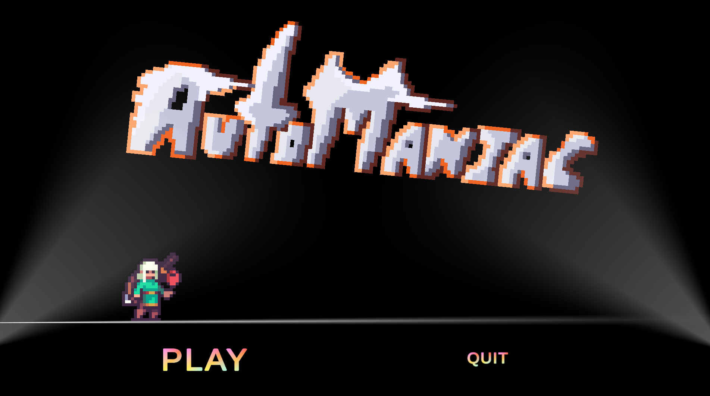
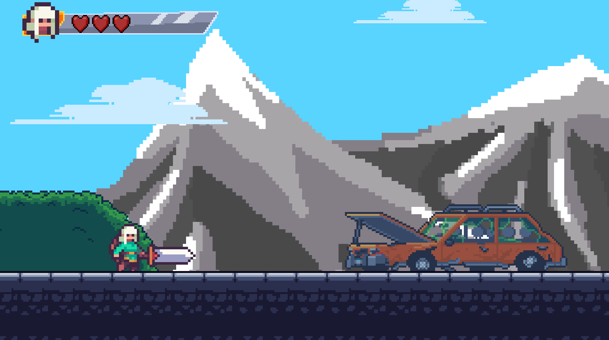
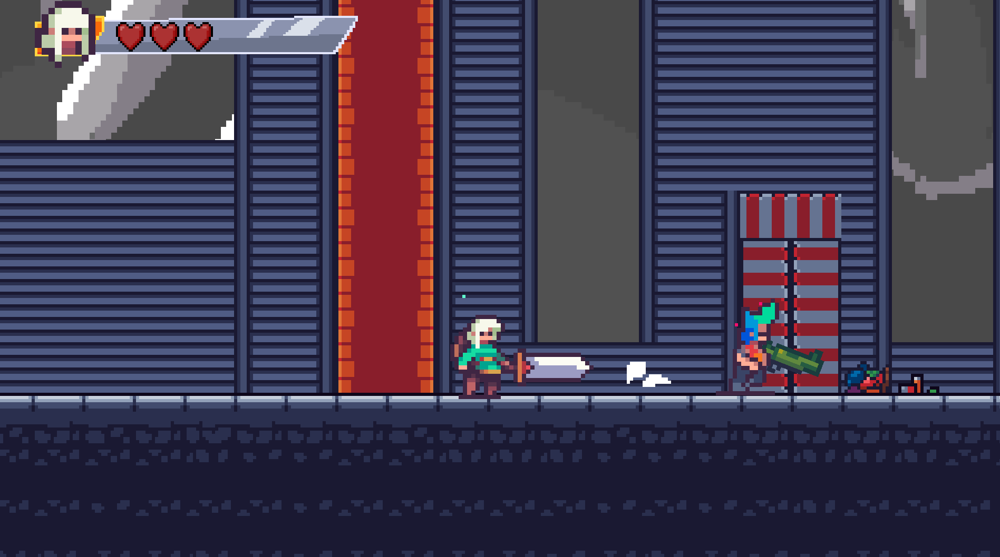
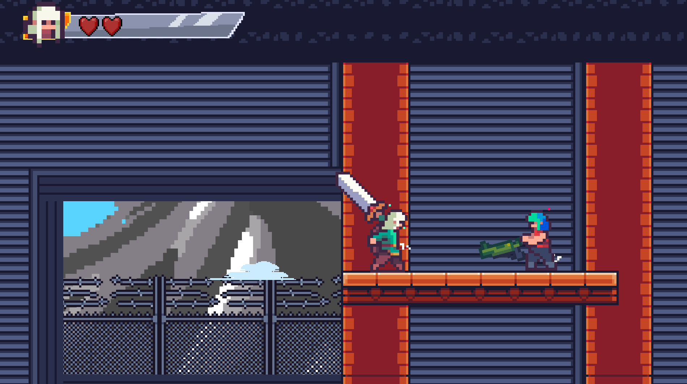
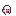

# AutoManiac
AutoManiac is a minigame developed by me, where you play as a hero who enters a dungeon inhabited by automatons that have gone rogue and taken up arms to kill people. Your mission is to stop them and venture deep into the dungeon to defeat their leader. Are you capable of accomplishing this task?  Estimated playtime: 10 minutes.

# Description

AutoManiac is a 2D action game developed with Unity. Face encounters, dodge attacks, and survive and intense battle with the main boss while exploring a unique atmosphere enhanced by dynamic lighting and original music.

## Features

* Fast-paced 2D gameplay
* Boss battle mechanics
* Dynamic lighting effects
* Original soundtrack
* Pixel-art inspired visuals

## Screenshots

## Controls

| Action             | Key               |
| --------           | ----------------- |
| Move               | WASD              |
| Jump-DoubleJump    | Space             |
| Attack             | Left Mouse Button |

## Download

The latest version is available in the **Releases** section of this repository.

## Built With

* Unity
* C#

## Author

Samuel Barón

## Platform

Windows 64-bit

## License

All rights reserved.

This project, including its assets, music, artwork, and game content, may not be copied, modified, redistributed, or used commercially without explicit permission from the author.
